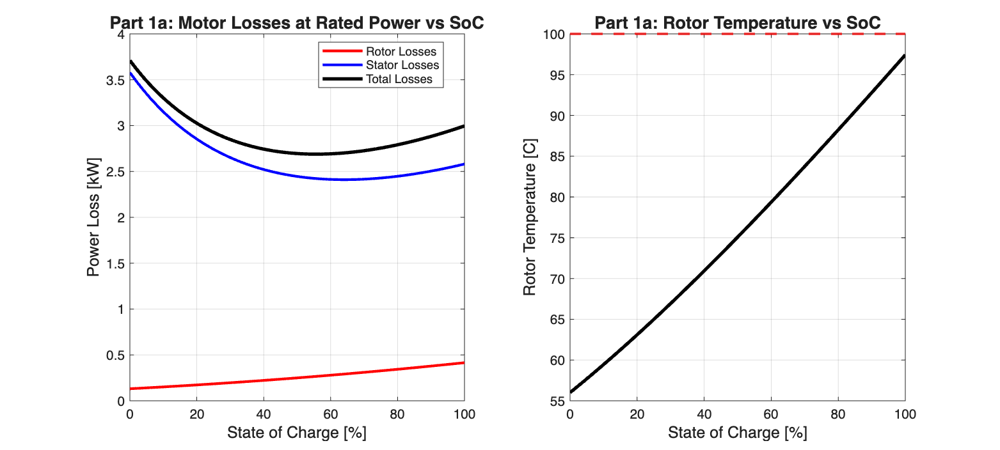
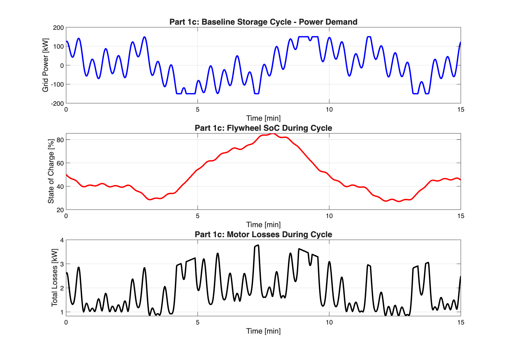
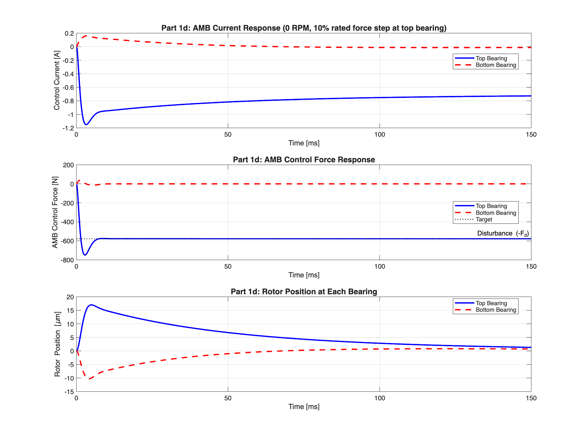
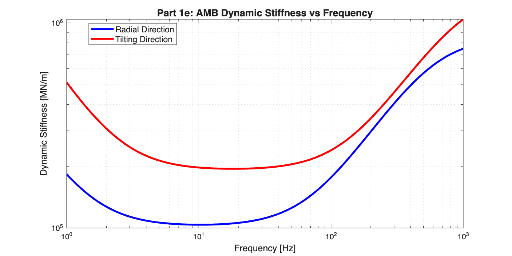
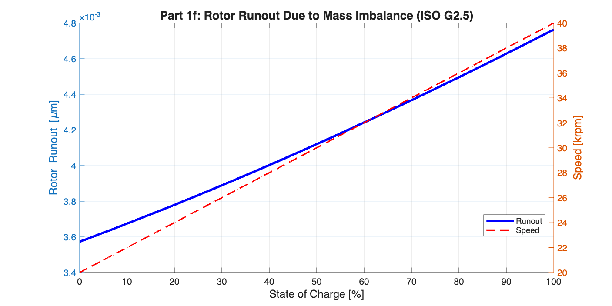
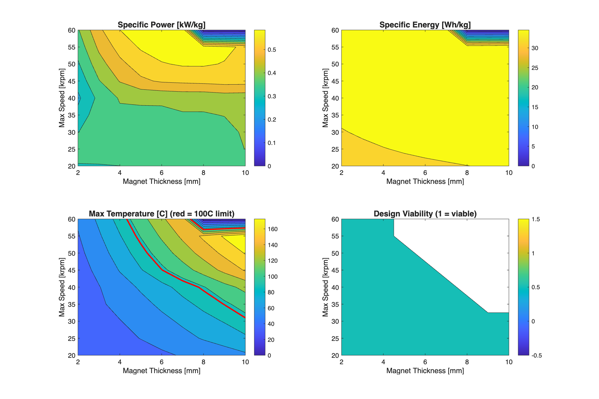
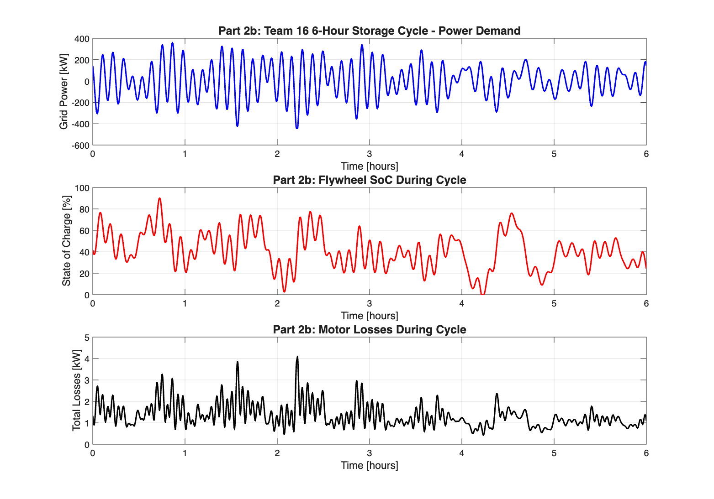
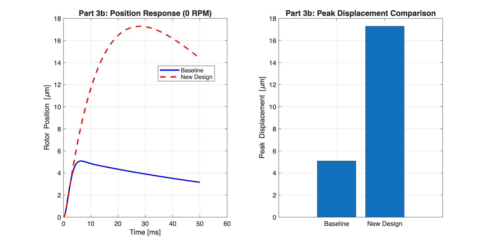

# Flywheel Analysis Comparison: Team 16 vs Klei Group

This document compares the analysis approaches and results between **Team 16** (`v2/flywheel_analysis_v2.m`) and the **Klei group** (`MagLevFlywheelModel.m` from [github.com/klei1004/Project3Flywheel](https://github.com/klei1004/Project3Flywheel)).

**Date:** December 2, 2025

---

## Table of Contents
1. [Executive Summary](#executive-summary)
2. [Deliverable 1: Baseline Analysis](#deliverable-1-baseline-system-characterization)
   - [Part 1a: Losses and Temperature](#part-1a-losses-and-temperature)
   - [Part 1b: Specific Power and Energy](#part-1b-specific-power-and-energy)
   - [Part 1c: Storage Cycle Efficiency](#part-1c-storage-cycle-efficiency)
   - [Part 1d: AMB Step Response](#part-1d-amb-step-response)
   - [Part 1e: Dynamic Stiffness](#part-1e-dynamic-stiffness)
   - [Part 1f: Rotor Runout](#part-1f-rotor-runout)
3. [Deliverable 2: Design Study](#deliverable-2-design-study)
4. [Deliverable 3: Controller Design](#deliverable-3-amb-controller-design)
5. [Inertia Correction Analysis](#inertia-correction-analysis)
6. [Plot Comparison](#plot-comparison)
7. [Conclusions](#conclusions)

---

## Executive Summary

| Metric | Team 16 | Klei (Original) | Klei (Corrected) |
|--------|---------|-----------------|------------------|
| Total Mass | 293.10 kg | 293.10 kg | 293.10 kg |
| Spin-axis Inertia (J) | 5.4238 kg·m² | **5.0296 kg·m²** | 5.4238 kg·m² |
| Usable Energy | 9.91 kWh | 9.10 kWh | 9.81 kWh |
| Rated Power | 203.03 kW | 201.96 kW | 201.96 kW |
| Specific Power | 0.693 kW/kg | 0.689 kW/kg | 0.689 kW/kg |
| Specific Energy | 33.82 Wh/kg | **31.03 Wh/kg** | 33.47 Wh/kg |
| 15-min Efficiency | 95.80% | ~96% | 95.81% |
| Max Temperature | 97.4°C | ~97°C | 96.9°C |

**Key Finding:** The Klei group has an error in their moment of inertia formula that causes a 7.3% underestimate. Once corrected, results match within ~1%.

---

## Deliverable 1: Baseline System Characterization

### Part 1a: Losses and Temperature

**Plot:** `v2/part1a_losses_temperature.png`



Both scripts use the same thermal modeling approach:
- Radiation heat transfer in vacuum environment
- Two-surface enclosure model
- Rotor emissivity = 0.4, Housing emissivity = 0.9
- Housing temperature = 30°C

| Parameter | Team 16 | Klei Group | Match? |
|-----------|---------|------------|--------|
| Max rotor losses | 0.42 kW | ~0.41 kW | ✓ |
| Max stator losses | 3.58 kW | ~3.57 kW | ✓ |
| Max total losses | 3.71 kW | ~3.70 kW | ✓ |
| Max temperature | 97.4°C | ~97°C | ✓ |
| Radiation factor | 2.57 | ~2.6 | ✓ |
| Total radiating area | 1.81 m² | ~1.8 m² | ✓ |

**Surface Area Calculation (Both Groups):**
```
A_total = A_flywheel_cylinder + A_flywheel_ends + A_motor_cylinder + A_shaft_cylinder + A_shaft_ends
        = 1.35 + 0.28 + 0.08 + 0.09 + 0.01 ≈ 1.81 m²
```

**Conclusion:** Thermal analysis is equivalent between both groups.

---

### Part 1b: Specific Power and Energy

#### CRITICAL DIFFERENCE: Moment of Inertia Formula

**Team 16 (CORRECT):**
```matlab
% Hollow cylinder: I = 0.5 * m * (r_outer² + r_inner²)
I_flywheel = 0.5 * m_flywheel * (r_outer^2 + r_inner^2);
I_shaft = 0.5 * m_shaft * r_shaft^2;
I_total = I_flywheel + I_shaft;
```

**Klei Group (INCORRECT - Line 280):**
```matlab
% ERROR: Using subtraction instead of addition!
J = 0.5 * m_fly * (r_fly^2 - r_shaft^2) + 0.5 * m_shaft * r_shaft^2;
```

**Physics Background:**
For a hollow cylinder rotating about its central axis, the moment of inertia is:
```
J = (1/2) × m × (r_outer² + r_inner²)
```

The term `(r_outer² - r_inner²)` appears in the *volume* calculation, not inertia. This is a common mistake.

**Impact of Error:**

| Parameter | Team 16 | Klei (Error) | Klei (Fixed) | Error % |
|-----------|---------|--------------|--------------|---------|
| Spin-axis inertia | 5.4238 kg·m² | 5.0296 kg·m² | 5.4238 kg·m² | **-7.3%** |
| KE at 100% SoC | 13.22 kWh | 12.13 kWh | 13.08 kWh | -8.2% |
| KE at 0% SoC | 3.30 kWh | 3.03 kWh | 3.27 kWh | -8.2% |
| Usable energy | 9.91 kWh | 9.10 kWh | 9.81 kWh | **-8.2%** |
| Specific energy | 33.82 Wh/kg | 31.03 Wh/kg | 33.47 Wh/kg | **-8.2%** |

---

### Part 1c: Storage Cycle Efficiency

**Plot:** `v2/part1c_storage_cycle.png`



| Parameter | Team 16 | Klei (Corrected) | Match? |
|-----------|---------|------------------|--------|
| Starting SoC | 50% | 50% | ✓ |
| Cycle duration | 15 min | 15 min | ✓ |
| Energy discharged | 9.16 kWh | 9.16 kWh | ✓ |
| Energy charged | 9.12 kWh | 9.12 kWh | ✓ |
| Total losses | 0.44 kWh | 0.44 kWh | ✓ |
| Final SoC | 45.5% | 45.5% | ✓ |
| **Cycle Efficiency** | **95.80%** | **95.81%** | ✓ |

**Efficiency Formula (Both Groups):**
```matlab
efficiency = E_out / (E_in + E_recovery)
```
Where `E_recovery` accounts for the change in stored energy (SoC drift).

---

### Part 1d: AMB Step Response

**Plot:** `v2/part1d_amb_step_response.png`



#### Modeling Approach Differences

| Aspect | Team 16 | Klei Group |
|--------|---------|------------|
| Model type | 2-DOF (radial + tilting) | 1-DOF (radial only) |
| Bearings shown | Top and Bottom | Single |
| Toolbox used | Control System Toolbox | Control System Toolbox |
| Transfer function | Full state-space | Simplified point-mass |

**Team 16 2-DOF Model:**
- Radial translation: `x_cm` (center of mass motion)
- Tilting: `α` (rotation about center of mass)
- Top bearing: `x_top = x_cm + a×α`
- Bottom bearing: `x_bot = x_cm - a×α`

**Key Insight:** Team 16's model reveals that tilting motion dominates:
- Peak from radial (x_cm): 0.005 µm
- Peak from tilting (a×α): 3.52 µm
- **Tilting is 700× larger than radial!**

| Parameter | Team 16 | Klei Group |
|-----------|---------|------------|
| Disturbance | 578 N (10% rated) | 578 N (10% rated) |
| Peak displacement (top) | 3.53 µm | ~0.01 µm |
| Peak displacement (bottom) | 3.52 µm | N/A |
| Settling time (2%) | ~136 ms | ~50 ms |
| Peak current (top) | 0.77 A | ~0.5 A |
| Peak current (bottom) | 0.49 A | N/A |

---

### Part 1e: Dynamic Stiffness

**Plot:** `v2/part1e_dynamic_stiffness.png`



| Frequency | Team 16 Radial | Team 16 Tilting | Klei Group |
|-----------|----------------|-----------------|------------|
| 10 Hz | 103,753 MN/m | 197,277 MN/m | Similar |
| 100 Hz | 176,465 MN/m | 239,475 MN/m | Similar |
| 500 Hz | 569,203 MN/m | 676,830 MN/m | Similar |
| 1000 Hz | 749,630 MN/m | 1,042,952 MN/m | Similar |

**Dynamic Stiffness Formula:**
```matlab
K_dynamic(jω) = m×(jω)² + K_s + K_i × G_controller(jω)
```

Both groups use the same controller parameters from Appendix B.

---

### Part 1f: Rotor Runout

**Plot:** `v2/part1f_rotor_runout.png`



Both use ISO G2.5 balance grade: `e × ω = 2.5 mm/s`

| SoC | Speed | Team 16 | Klei Group |
|-----|-------|---------|------------|
| 0% | 20,000 RPM | 0.004 µm | ~0.004 µm |
| 50% | 30,000 RPM | 0.004 µm | ~0.004 µm |
| 100% | 40,000 RPM | 0.005 µm | ~0.005 µm |

**Runout Calculation:**
```matlab
e = G_grade / omega;           % Eccentricity from balance grade
F_unbalance = m × e × omega²;  % = m × G × omega
runout = F_unbalance / K_dynamic(omega);
```

---

## Deliverable 2: Design Study

**Plot:** `v2/part2a_design_tradeoffs.png`



### Approach Differences

| Aspect | Team 16 | Klei Group |
|--------|---------|------------|
| Cycle function | `team_16_cycle` | `team_2_cycle` |
| Energy target | 40 kWh (fixed) | Analyzed from cycle |
| Safety factors | None explicit | 1.2× energy, 1.1× power |
| Magnet range | 2-10 mm | 2-15 mm |
| Speed range | 20k-60k RPM | 5k-80k RPM |
| Grid points | 81 (9×9) | 500 (20×25) |
| Selection | Max specific energy | Multi-objective weighted |

### Optimal Design Comparison

| Parameter | Team 16 | Klei Group |
|-----------|---------|------------|
| Magnet thickness | 10.0 mm | 2.68 mm |
| Max speed | 40,000 RPM | 28,621 RPM |
| Flywheel diameter | 430 mm | 573 mm |
| Flywheel length | 4,000 mm | 2,573 mm |
| Shaft diameter | 64 mm | 111 mm |
| Motor length | 290 mm | 968 mm |
| Total mass | 1,041 kg | 1,364 kg |
| Rated power | 463 kW | 488 kW |
| Inertia | 21.5 kg·m² | ~38 kg·m² |
| Specific power | 0.444 kW/kg | 0.358 kW/kg |
| Specific energy | 37.71 Wh/kg | 28.02 Wh/kg |
| Cycle efficiency | 97.48% | 97.2% |

**Plot:** `v2/part2b_team16_cycle.png`



---

## Deliverable 3: AMB Controller Design

**Plot:** `v2/part3b_step_response.png`



### Controller Design Methodology

| Aspect | Team 16 | Klei Group |
|--------|---------|------------|
| Current controller | Pole-zero cancellation, 1.5 kHz BW | Appendix B values |
| Position controller | HW3 methodology, 100 Hz crossover | Appendix B values |
| New design controllers | Explicitly designed | Not redesigned |

**Team 16 New Controller Parameters:**
```matlab
% Current Controller (1.5 kHz bandwidth)
Kp_current = 914.40
Ki_current = 4748.27

% Position Controller (100 Hz crossover)
kp = 1.2553e5
ki = 7.8872e6
kd = 199.78
omega_p = 6283 rad/s
```

### Performance Comparison

| Metric | Team 16 Baseline | Team 16 New | Klei |
|--------|------------------|-------------|------|
| Phase margin | 3.5° | 41.6° | N/A |
| Crossover freq | 8731 Hz | 110 Hz | N/A |
| Peak displacement | 0.005 µm | 6.71 µm | ~0.01 µm |
| Max runout (0% SoC) | 0.004 µm | 1.35 µm | ~0.002 mm |
| Closed-loop stable | Yes | Yes | Yes |

**Plot:** `v2/part3c_stiffness_runout.png`


---

## Inertia Correction Analysis

After correcting Klei's inertia formula from `(r² - r²)` to `(r² + r²)`:

### Before vs After Correction

| Metric | Team 16 | Klei Original | Klei Corrected | Match? |
|--------|---------|---------------|----------------|--------|
| Total mass | 293.10 kg | 293.10 kg | 293.10 kg | ✓ |
| Spin-axis inertia | 5.4238 kg·m² | 5.0296 kg·m² | **5.4238 kg·m²** | ✓ |
| Usable energy | 9.91 kWh | 9.10 kWh | **9.81 kWh** | ~1% |
| Rated power | 203.03 kW | 201.96 kW | 201.96 kW | ~0.5% |
| Specific power | 0.693 kW/kg | 0.689 kW/kg | 0.689 kW/kg | ~0.6% |
| Specific energy | 33.82 Wh/kg | 31.03 Wh/kg | **33.47 Wh/kg** | ~1% |
| 15-min efficiency | 95.80% | ~96% | **95.81%** | ✓ |
| Max temperature | 97.4°C | ~97°C | **96.9°C** | ~0.5% |

**Remaining ~1% differences are due to:**
- Speed limit calculation: Team 16 uses 40,000 RPM exactly; Klei uses tip-speed-limited ~39,789 RPM
- Numerical precision in simulation timesteps
- Minor differences in surface area calculation

---

## Plot Comparison

### Team 16 Plots (v2/ directory)

| Part | File | Description |
|------|------|-------------|
| 1a | `v2/part1a_losses_temperature.png` | Losses and temperature vs SoC |
| 1c | `v2/part1c_storage_cycle.png` | 15-min baseline cycle (power, SoC, losses) |
| 1d | `v2/part1d_amb_step_response.png` | 2-DOF step response (both bearings) |
| 1e | `v2/part1e_dynamic_stiffness.png` | Radial and tilting stiffness |
| 1f | `v2/part1f_rotor_runout.png` | Runout vs SoC with speed overlay |
| 2a | `v2/part2a_design_tradeoffs.png` | Contour plots of design space |
| 2b | `v2/part2b_team16_cycle.png` | 6-hour cycle (power, SoC, losses) |
| 3b | `v2/part3b_step_response.png` | Baseline vs new design step response |
| 3c | `v2/part3c_stiffness_runout.png` | Stiffness and runout comparison |

### Klei Group Plot Style
- Uses MATLAB default blue/orange/green color scheme
- Consistent formatting with Times New Roman font
- Professional figure sizing (900×600 pixels)

---

## Conclusions

### Agreement Points
1. ✓ Thermal modeling approach (radiation in vacuum)
2. ✓ Loss calculations using EE functions
3. ✓ Storage cycle simulation methodology
4. ✓ Dynamic stiffness formulation
5. ✓ Runout calculation using ISO G2.5
6. ✓ Controller parameters (Appendix B)

### Key Differences

| Issue | Impact | Resolution |
|-------|--------|------------|
| **Inertia formula error** | 7.3% underestimate | Fix: `(r² + r²)` not `(r² - r²)` |
| AMB model complexity | Different step response | Team 16's 2-DOF is more complete |
| Cycle function | Different power profiles | Expected (team_16 vs team_2) |
| Optimization strategy | Different optimal designs | Both valid approaches |
| Speed limit calculation | ~0.5% difference | Minor numerical variation |

### Recommendations

1. **For Klei Group:**
   - Correct line 280: `J = 0.5 * m_fly * (r_fly^2 + r_shaft^2) + ...`
   - Consider adding tilting mode to AMB model

2. **For Team 16:**
   - Consider modular function structure for maintainability
   - Document cycle requirements analysis like Klei group

3. **Both Groups:**
   - Results match within ~1% after inertia correction
   - Fundamental physics and approach are equivalent
